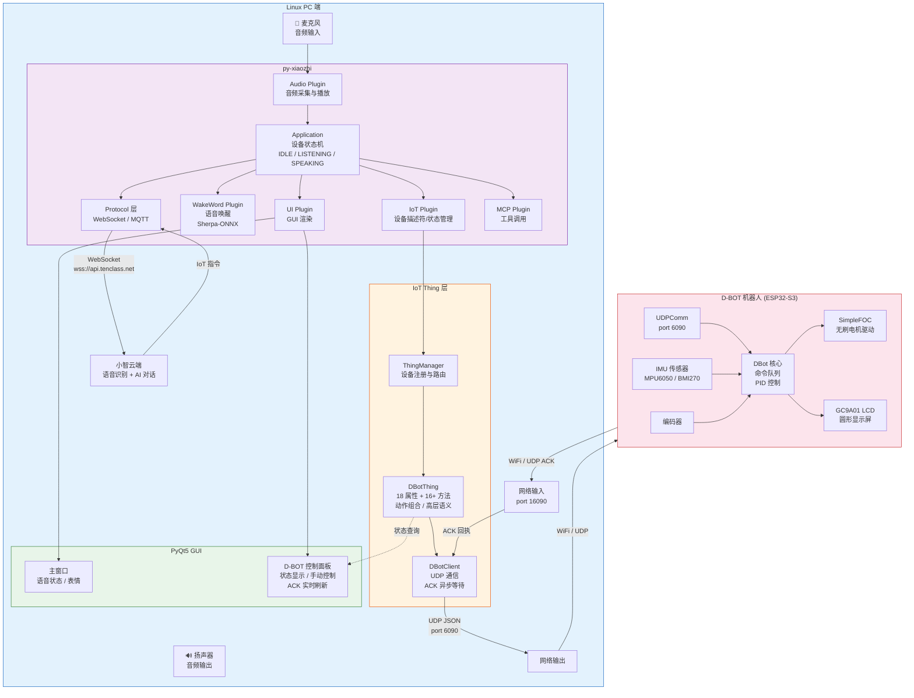
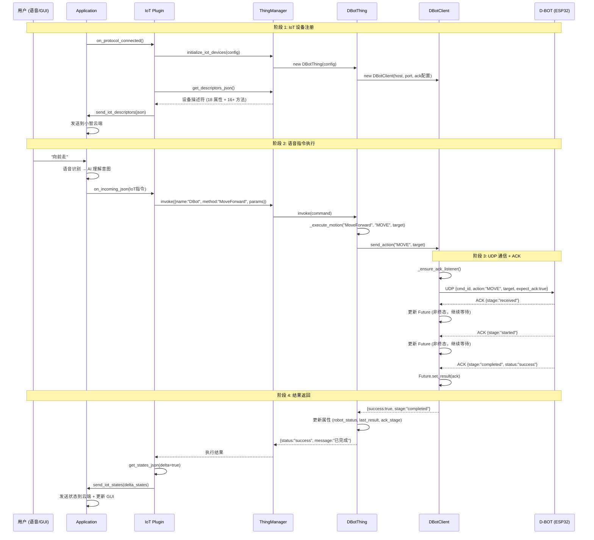
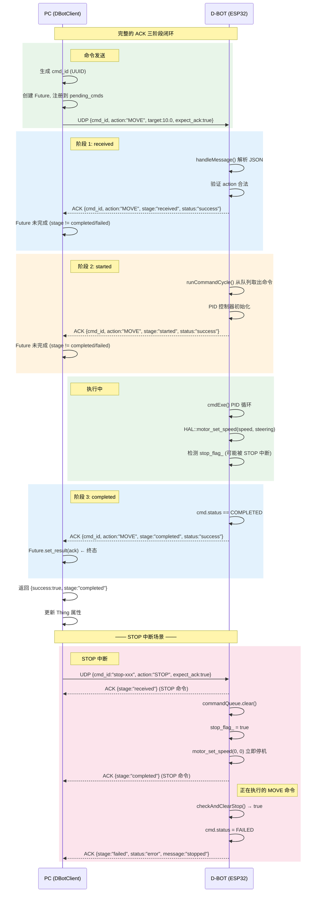

# 系统架构图

本文档包含三张 Mermaid 架构图，展示系统的整体架构、IoT/Thing 调用流程和 UDP ACK 闭环流程。

---

## 1. 系统总体架构图



---

## 2. IoT/Thing 调用流程图



---

## 3. UDP ACK 闭环流程图



---

## 附：ACK JSON 格式参考

### PC → D-BOT（命令）

```json
{
  "cmd_id": "550e8400-e29b-41d4-a716-446655440000",
  "action": "MOVE",
  "target": 10.0,
  "expect_ack": true
}
```

### D-BOT → PC（ACK 回执）

```json
{
  "cmd_id": "550e8400-e29b-41d4-a716-446655440000",
  "action": "MOVE",
  "stage": "completed",
  "status": "success"
}
```

### ACK 阶段说明

| stage | 含义 | 触发时机 |
|-------|------|----------|
| `received` | 命令已收到 | `handleMessage()` 解析 JSON 后立即发送 |
| `started` | 命令开始执行 | `runCommandCycle()` 从队列取出命令后 |
| `completed` | 命令执行完成 | `cmd.status == COMPLETED` |
| `failed` | 命令执行失败 | 被 STOP 中断或执行异常 |
